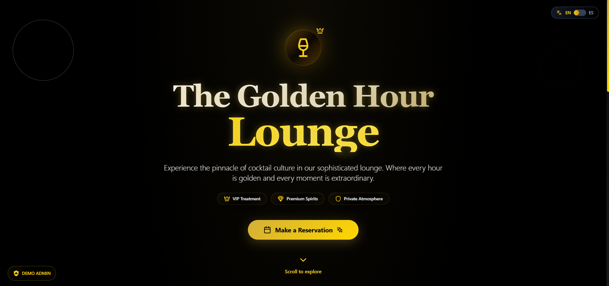
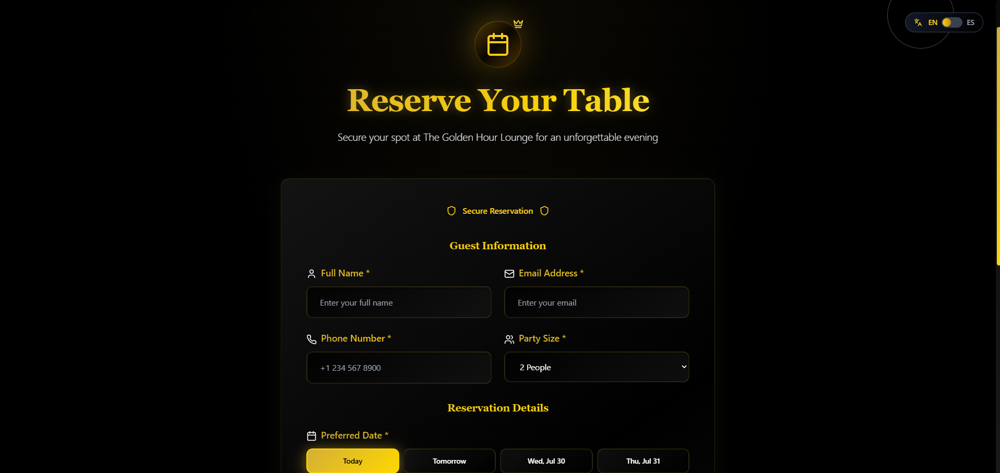
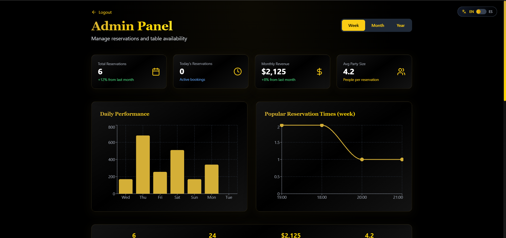
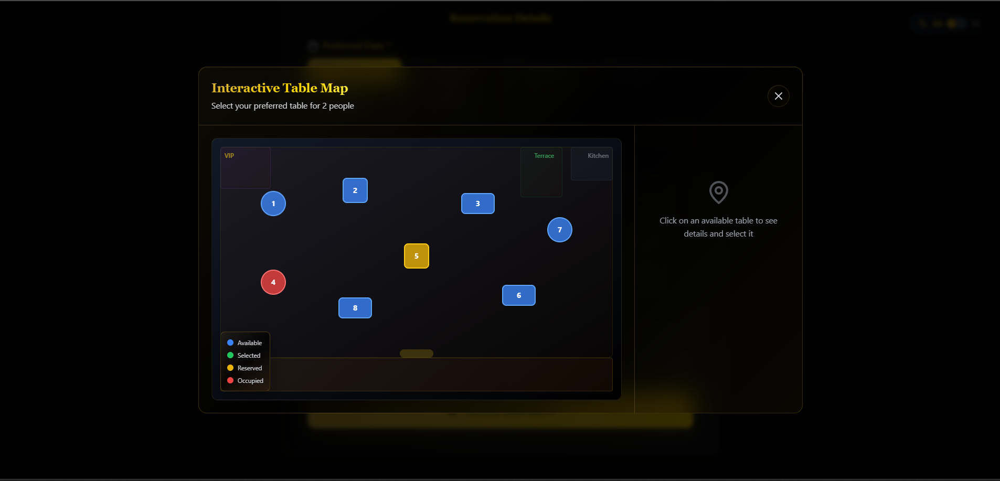

# 🍸 The Golden Hour Lounge - Restaurant Reservation System

A sophisticated, full-stack restaurant reservation management system built with modern web technologies. This is a **portfolio demonstration** of a fully functional application originally created for a premium bar in Zapopan, Jalisco, Mexico.

## 🌟 Overview

This application showcases a complete restaurant reservation ecosystem with three distinct user roles, real-time table management, payment processing simulation, and comprehensive analytics. Originally designed for an upscale cocktail lounge, it demonstrates enterprise-level functionality with premium UI/UX design.

## ✨ Key Features

### 🎯 Multi-Role Dashboard System
- **👑 Admin Dashboard**: Complete analytics, revenue tracking, and system management
- **🤝 Relationship Manager (RP)**: Client reservation management and personal statistics  
- **👋 Hostess Dashboard**: QR code scanning and guest check-in system

### 📱 Customer Experience
- **Elegant Landing Page**: Premium design with smooth animations
- **Interactive Reservation Form**: Smart date/time selection with validation
- **Table Selection**: Visual table map with real-time availability
- **Payment Processing**: Simulated secure payment flow
- **QR Confirmation**: Digital reservation passes with QR codes

### 🛠️ Technical Features
- **Bilingual Support**: Complete English/Spanish localization
- **Responsive Design**: Optimized for all devices
- **Real-time Updates**: Dynamic availability and booking management
- **Advanced Animations**: Smooth transitions and micro-interactions
- **Glass Morphism UI**: Modern design with sophisticated visual effects

## 🚀 Live Demo

**[View Live Demo]()**

> **⚠️ Important**: This is a portfolio demonstration. No real reservations are processed, no actual payments are charged, and all data is simulated for showcase purposes.

## 🛠️ Tech Stack

### Frontend
- **React 18** - Modern React with hooks and context
- **TypeScript** - Type-safe development
- **Tailwind CSS** - Utility-first styling with custom components
- **Lucide React** - Beautiful, consistent icons
- **Recharts** - Interactive data visualization
- **QRCode.js** - QR code generation

### Development Tools
- **Vite** - Lightning-fast build tool
- **ESLint** - Code quality and consistency
- **PostCSS** - Advanced CSS processing

### Design System
- **Custom Glass Morphism** - Sophisticated UI components
- **Golden Color Palette** - Premium brand aesthetics
- **Responsive Grid System** - Mobile-first approach
- **Advanced Animations** - CSS keyframes and transitions

## 📋 User Roles & Capabilities

### 👑 Administrator
- **Analytics Dashboard**: Revenue, reservations, and performance metrics
- **Reservation Management**: View, edit, and manage all bookings
- **Table Management**: Real-time table status and availability
- **User Management**: Control access and permissions
- **Reporting**: Detailed insights and trends

### 🤝 Relationship Manager (RP)
- **Client Reservations**: Create and manage client bookings
- **Personal Statistics**: Track individual performance metrics
- **Custom Notes**: Add special requests and preferences
- **Client Database**: Maintain customer relationships

### 👋 Hostess
- **QR Code Scanner**: Quick guest check-in system
- **Daily Reservations**: View today's booking schedule
- **Guest Management**: Check-in and seating coordination
- **Real-time Updates**: Live reservation status

## 🎨 Design Philosophy

### Premium Aesthetics
- **Sophisticated Color Scheme**: Gold gradients with dark themes
- **Glass Morphism Effects**: Modern, translucent UI elements
- **Smooth Animations**: Carefully crafted micro-interactions
- **Typography**: Elegant serif headings with clean sans-serif body text

### User Experience
- **Intuitive Navigation**: Clear information hierarchy
- **Responsive Design**: Seamless across all devices
- **Accessibility**: WCAG compliant with proper contrast ratios
- **Performance**: Optimized loading and smooth interactions

## 🌐 Internationalization

Complete bilingual support with:
- **English**: Primary language with professional terminology
- **Spanish**: Full localization for Mexican market
- **Dynamic Switching**: Real-time language toggle
- **Cultural Adaptation**: Appropriate formatting and conventions

## 📱 Screenshots

### Landing Page


### Reservation System


### Admin Dashboard


### Table Selection


## 🚀 Getting Started

### Prerequisites
- Node.js 18+ 
- npm or yarn

### Installation

1. **Clone the repository**
   ```bash
   git clone https://github.com/yourusername/golden-hour-lounge.git
   cd golden-hour-lounge
   ```

2. **Install dependencies**
   ```bash
   npm install
   ```

3. **Start development server**
   ```bash
   npm run dev
   ```

4. **Open your browser**
   ```
   http://localhost:5173
   ```

### Build for Production

```bash
npm run build
npm run preview
```

## 🎯 Demo Usage

### Customer Flow
1. **Landing Page**: View restaurant information and features
2. **Make Reservation**: Fill out booking form with date/time selection
3. **Select Table**: Choose from interactive table map (optional)
4. **Payment**: Complete simulated payment process
5. **Confirmation**: Receive QR code confirmation

### Staff Access
- **Admin Login**: Click "DEMO ADMIN" button on landing page
- **Role Selection**: Choose from Admin, RP, or Hostess roles
- **Dashboard Access**: Explore role-specific functionality

## 🔧 Configuration

### Environment Variables
```env
VITE_APP_TITLE=The Golden Hour Lounge
VITE_DEFAULT_LANGUAGE=en
VITE_DEMO_MODE=true
```

### Customization
- **Colors**: Modify `tailwind.config.js` for brand colors
- **Translations**: Update `src/context/LanguageContext.tsx`
- **Components**: Customize in `src/components/`

## 📊 Features Showcase

### Advanced Functionality
- ✅ **Multi-role Authentication System**
- ✅ **Real-time Table Management**
- ✅ **Interactive Analytics Dashboard**
- ✅ **QR Code Generation & Scanning**
- ✅ **Payment Flow Simulation**
- ✅ **Responsive Design System**
- ✅ **Bilingual Support**
- ✅ **Advanced Animations**

### Business Logic
- ✅ **Availability Management**
- ✅ **Booking Validation**
- ✅ **Revenue Tracking**
- ✅ **Customer Relationship Management**
- ✅ **Staff Workflow Optimization**

## 🎨 Design System

### Color Palette
```css
Primary Gold: #d4af37
Secondary Gold: #ffd700
Accent Gold: #ffed4e
Dark Background: #000000
Glass Effects: rgba(212, 175, 55, 0.1)
```

### Typography
- **Headings**: Playfair Display (Serif)
- **Body**: Inter (Sans-serif)
- **UI Elements**: System fonts for performance

## 🤝 Contributing

This is a portfolio project, but feedback and suggestions are welcome!

1. Fork the repository
2. Create a feature branch
3. Make your changes
4. Submit a pull request

## 📄 License

This project is for portfolio demonstration purposes. The design and concept were originally created for a client in Zapopan, Jalisco, Mexico.

## 👨‍💻 About the Developer

This application demonstrates expertise in:
- **Frontend Development**: React, TypeScript, Modern CSS
- **UI/UX Design**: User-centered design principles
- **System Architecture**: Scalable component structure
- **Business Logic**: Real-world application requirements
- **Internationalization**: Multi-language support
- **Performance Optimization**: Fast, responsive applications

## 📞 Contact

For questions about this project or potential collaborations:

- **LinkedIn**: [linkedin.com/in/froylanrendon/]
- **Email**: [froyrico2@gmail.com]

---

**⚠️ Disclaimer**: This is a portfolio demonstration. All reservation data is simulated, no real bookings are processed, and no actual payments are charged. Originally created as a custom solution for a premium bar in Zapopan, Jalisco, Mexico.

---